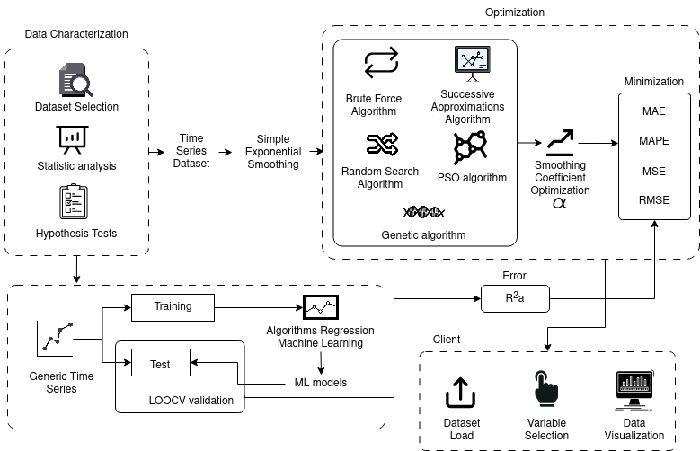

  # Serial Time Optimization

  
*Figure 1: Methodological workflow.*

## Abstract

Time series forecasting with **Simple Exponential Smoothing (SES)** depends heavily on choosing the right smoothing coefficient **α**. This repository presents **SESOpt**, a framework to **optimize α** using both traditional and AI-based methods. We explore:

- **5 optimization techniques**: Brute-force, Successive Approximations, Random Search, Genetic Algorithm, and Particle Swarm Optimization.
- **2 machine learning models**: Support Vector Machine and Random Forest for α prediction.

The approach was tested on **20 time series datasets** from various domains. Model quality was evaluated with **MSE**, **RMSE**, **MAE**, and **MAPE**, while convexity and statistical assumptions were verified.

### Highlights

- **AI techniques approximate optimal α** with high efficiency.
- **Successive Approximations** match brute-force accuracy with lower computational cost.
- **Convex error surfaces** for most datasets aid robust optimization.

---

## Implemented Algorithms

### Optimization Algorithms

1. **Brute Force (FB)** – Exhaustive grid search over α ∈ (0,1).  
2. **Successive Approximations (AS)** – Recursive α range refinement.
3. **Random Search (BA)** – Gaussian-sampled α optimization.
4. **Genetic Algorithm (GA)** – Evolutionary approach with crossover and mutation.
5. **Particle Swarm Optimization (PSO)** – Swarm-based global search.

### Machine Learning Models

- **Support Vector Machine (SVM)** – Regression model with radial kernel.
- **Random Forest (RF)** – Ensemble regression using 500 trees.

---

## Repository Structure

```text
├── SES_Model.R              # Core SES logic and error metrics
├── Optimization_Algorithms.R  # FB, AS, BA, GA, PSO implementations
├── MachineLearning_Models.R   # SVM and RF for alpha prediction
├── Datasets_Preparation.R     # Data loading, testing, normalization
├── results_SESOpt.csv         # Forecast metrics for each method
├── execution_times.csv        # Timing data for algorithms
├── hypothesis_tests.csv       # Statistical assumption results
```

---

##  Requirements

Install dependencies in R:

```r
install.packages(c(
  "forecast", "stats", "dplyr", "ggplot2", "caret", "e1071",
  "randomForest", "GA", "pso", "tseries", "lawstat", "moments"
))
```

---

## Dataset Preparation

Run the following to prepare and normalize datasets:

```r
source("Datasets_Preparation.R")  # Prepares 20 time series datasets
```

Datasets are grouped by size:

- **G1**: [1, 100)
- **G2**: [100, 1,000)
- **G3**: [1,000, 10,000)
- **G4**: [10,000, ∞)

---

##  Basic Usage

### Optimize α for a Dataset

```r
dataset <- datasets_list[["D01"]]
alpha_opt <- optimize_alpha(dataset$Yt, method = "GA")  # Options: "FB", "AS", "BA", "PSO"
forecast_result <- SES(dataset$Yt, alpha_opt)
```

### Predict α via Machine Learning

```r
features <- extract_features(dataset)
predicted_alpha <- predict_alpha(features, model = "RF")  # Options: "SVM", "RF"
```

---

## Results

All experiments were performed on 20 real-world time series datasets, analyzed using:

- **Forecast Error Metrics**:
  - `MSE` - Mean Squared Error
  - `RMSE` - Root Mean Squared Error
  - `MAE` - Mean Absolute Error
  - `MAPE` - Mean Absolute Percentage Error

- **Execution Time**:
  - Benchmarked for each algorithm and dataset
  - Tracked using R’s `proc.time()` and stored in `execution_times.csv`

- **Convexity & Statistical Assumptions**:
  - Tests include: Shapiro-Wilk, KPSS, Ljung-Box, Breusch-Pagan, Mann-Kendall
  - Results in `hypothesis_tests.csv`

---

## Web Application

Try the online prototype of SESOpt:  
🔗 [https://dievalhu.shinyapps.io/AlfaOpt](https://dievalhu.shinyapps.io/AlfaOpt)

Use the app to:
- Upload your dataset
- Visualize time series
- Auto-tune α using multiple methods
- Export forecast and optimized parameters

---

## Authors

**Diego Vallejo-Huanga**, **Julio Proaño**  
IDEIAGEOCA Research Group – Universidad Politécnica Salesiana  
 Contact: `dvallejoh@ups.edu.ec`, `jproanoo@ups.edu.ec`  
 April 2025

---

## Citation

If you use this work, please cite the original article:  
> Vallejo-Huanga, D., & Proaño, J. (2025). *Performance Optimization of Simple Exponential Smoothing Forecast Model*. Universidad Politécnica Salesiana.
